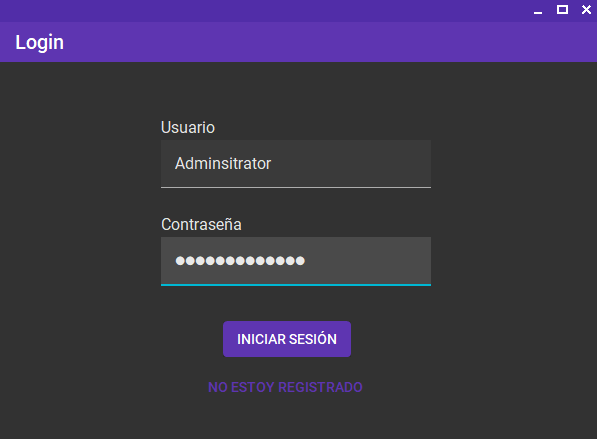
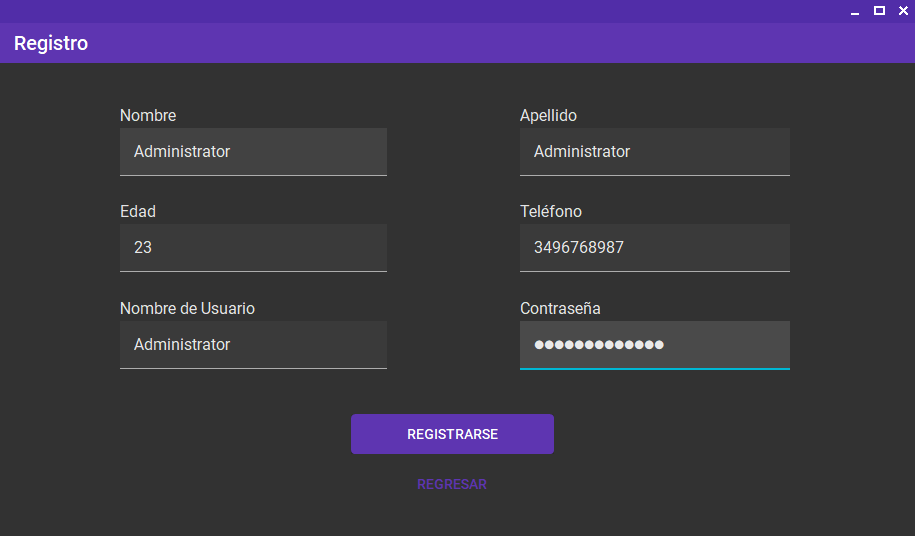
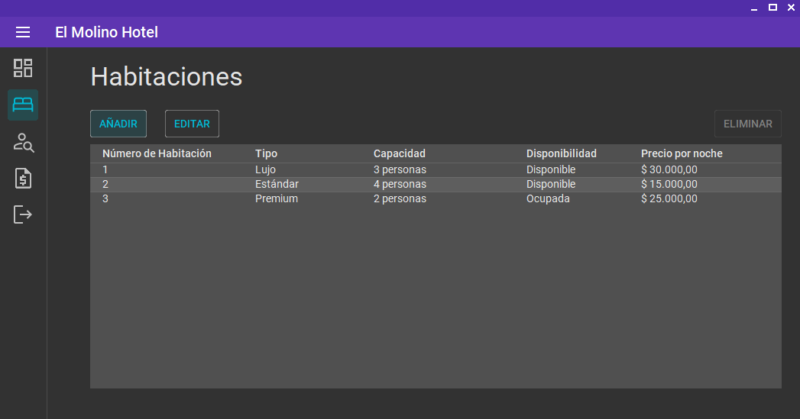
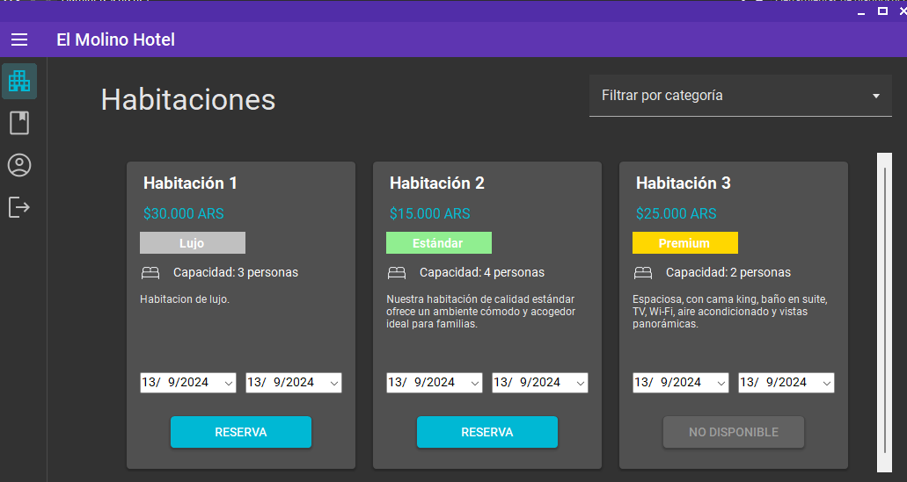

# 🏨 Sistema de Gestión de Hoteles

[](https://dotnet.microsoft.com/) 


## 📄 Descripción

El **Sistema de Gestión de Hoteles** es una aplicación que facilita la gestión diaria de un hotel, permitiendo manejar reservas, administrar clientes y gestionar habitaciones de manera eficiente. A diferencia de las soluciones tradicionales, utiliza archivos binarios en lugar de bases de datos relacionales para almacenar la información.

Este proyecto fue desarrollado como parte del **Trabajo Práctico Final** para la asignatura **Programación I** bajo la supervisión del docente [@franyack](https://github.com/franyack).


## ✨ Características

- 📅 **Gestión de reservas:** Realiza, modifica y cancela reservas.
- 🛏️ **Administración de habitaciones:** Controla la disponibilidad y ocupación de habitaciones.
- 👥 **Registro de clientes:** Guarda y gestiona la información de los clientes.
- 💾 **Almacenamiento binario:** Los datos se guardan en archivos binarios, eliminando la necesidad de una base de datos externa.


## 🛠️ Tecnologías utilizadas

- **Lenguaje:** 
- **Framework:** 
- **Almacenamiento:** Archivos binarios

### 📦 Paquetes

- **[MemoryPack](https://github.com/Cysharp/MemoryPack):** Utilizado para serializar y deserializar los datos en archivos binarios de manera eficiente.
  
- **[Unity](https://github.com/unitycontainer/unity):**  Para la gestión de dependencias entre componentes del sistema, mejorando la flexibilidad y mantenibilidad del código al permitir la inversión de control (IoC)

- **[MaterialSkin2](https://github.com/IgnaceMaes/MaterialSkin):** Mejora la interfaz de usuario de los formularios de winform con un diseño moderno y atractivo basado en Material Design.
  

## 📑 Guía del Trabajo Práctico

Este proyecto fue desarrollado conforme a las consignas del **Trabajo Práctico Final** para la asignatura **Programación I**:

### 🎯 Objetivo

El objetivo principal fue aplicar los conocimientos adquiridos para desarrollar un sistema completo de software, desde su diseño hasta su implementación.

### 🔧 Consignas principales

1. **Login de usuario:** Sistema de login para validación de usuarios.
2. **Gestión de reservas de habitaciones:**
   - Los **administradores** pueden añadir, borrar y modificar habitaciones.
   - Los **huéspedes** pueden buscar habitaciones, ver detalles y realizar reservas.

### 💡 Consideraciones

- Interfaz gráfica intuitiva y amigable.
- Mecanismos de control de errores.
- Diseño y presentación creativa de la aplicación.

### 📝 Entregables

- Código fuente organizado y documentado.
- Presentación que detalle el proceso de desarrollo, desafíos y aprendizajes.


## 🖼️ Capturas de Pantalla

### Pantalla de Login


### Pantalla de Registro


### Pantalla de Administrador


### Pantalla de Cliente



## 🚀 Instalación

### Requisitos previos

- **.NET Core SDK**: Instalar el [.NET SDK](https://dotnet.microsoft.com/download).

### Pasos

1. **Clonar el repositorio:**

   ```bash
   git clone https://github.com/tomiban/Hotel-Management-System-TP.git
   ```

2. **Navegar al directorio del proyecto:**

   ```bash
   cd Hotel-Management-System-TP/src/Presentation
   ```

3. **Ejecutar la aplicación:**

   ```bash
   dotnet run
   ```

4. La aplicación se iniciará y podrás interactuar con la interfaz gráfica para gestionar el hotel.

### 📂 Almacenamiento de Datos

- Los datos se guardan en archivos binarios en la carpeta `data/`. 


## 🤝 Contribuciones

¡Las contribuciones son bienvenidas! Si deseas colaborar, abre un issue o envía un pull request.


## 👥 Alumnos

Este proyecto fue desarrollado en conjunto por:

- Tiziano Mendez ([@tmendezz](https://github.com/tmendezz))
- Tomás Banchio
